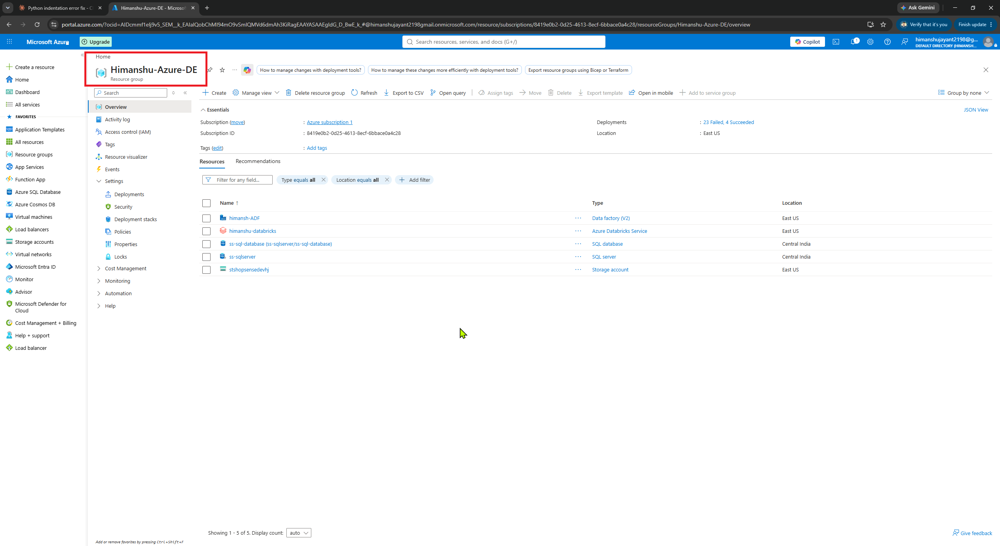
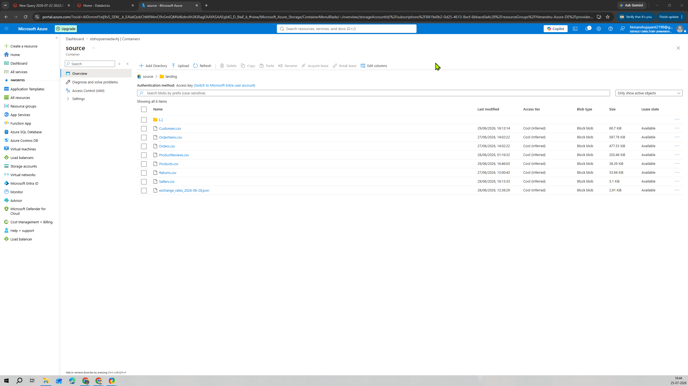
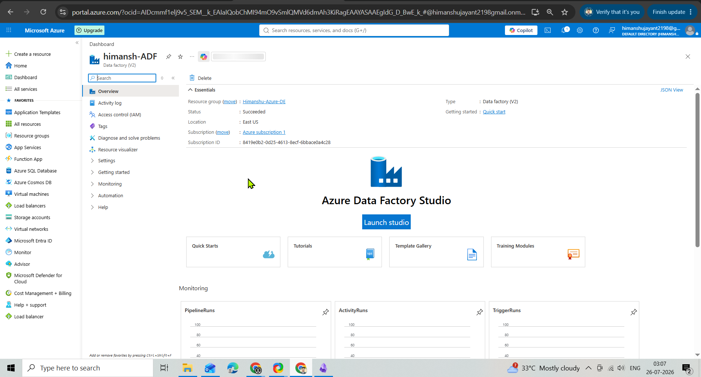
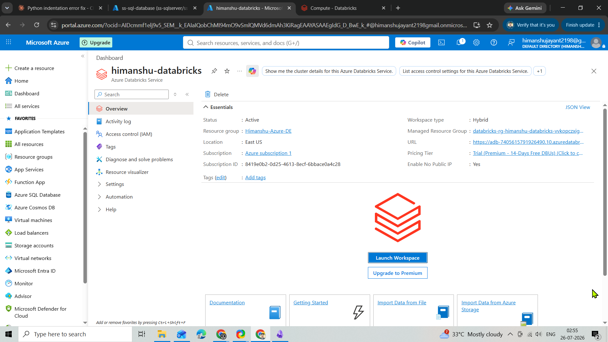

# Project Setup

## 1. Azure Resource Group

A dedicated Azure Resource Group was created to organise and manage all ShopSense resources in one place.

## 2. ADLS Gen2 — Initial Source Storage

The original CSV files were uploaded to ADLS Gen2.  
ADF pipelines then loaded these files into Azure SQL Database to simulate a real source system.

## 3. Azure SQL Database

Azure SQL Database was used as the primary source system for the main ingestion pipeline.
Before create a Azure sql database 
1. create a sql server

2. create a sql database

## 4. Azure Data Factory

Azure Data Factory was used to move data between the source systems and the Bronze layer.

## 5. Azure Databricks

Azure Databricks was used for PySpark transformations and for creating Silver and Gold tables.

